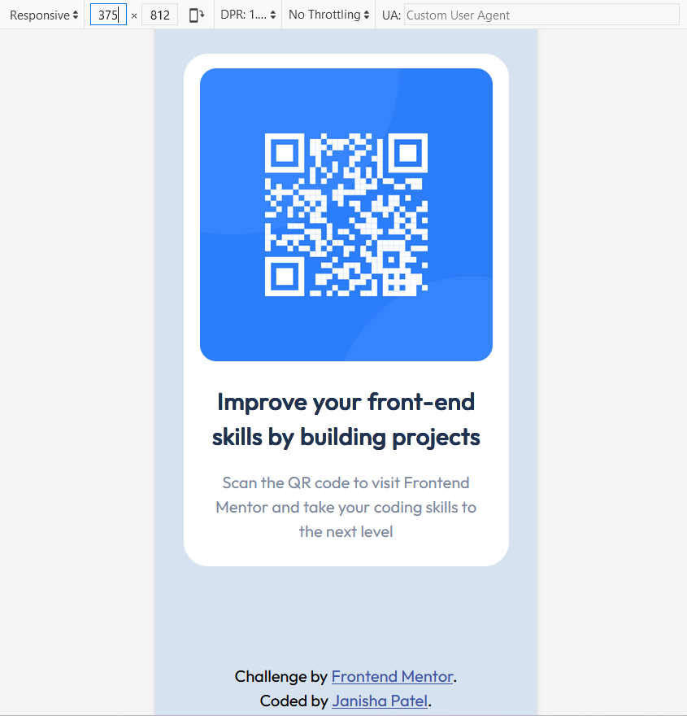
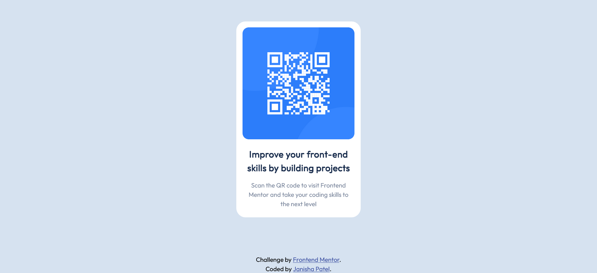

# Frontend Mentor - QR code component solution

This is a solution to the [QR code component challenge on Frontend Mentor](https://www.frontendmentor.io/challenges/qr-code-component-iux_sIO_H). Frontend Mentor challenges help you improve your coding skills by building realistic projects. 

## Table of contents

- [Overview](#overview)
  - [Screenshot](#screenshot)
  - [Links](#links)
- [My process](#my-process)
  - [Built with](#built-with)
  - [What I learned](#what-i-learned)
  - [Continued development](#continued-development)
  - [Useful resources](#useful-resources)
- [Author](#author)
- [Acknowledgments](#acknowledgments)

## Overview
The challenge was to build out the QR code component and get it looking as close to the design as possible.

### Screenshot

### Links
- Solution URL: [My solution URL](https://www.frontendmentor.io/solutions/responsive-qr-code-component-using-css-and-flexbox-2eSyhBmr1j)
- Live Site URL: [My Live site URL](https://janisha1.github.io/FEM-QR-Code/)

## My process
### Built with
- Semantic HTML5 markup
- CSS
- Flexbox
- Mobile-first design

### What I learned
I learnt that it is good practise to reset the CSS because of browser pre-set values.  

### Continued development
Would like to use sass or scss for styling in future.

### Useful resources
- [Reset CSS](https://andy-bell.co.uk/a-more-modern-css-reset/) - This was great at explaining the reset css code

## Author
- Website - In production
- Frontend Mentor - [@Janisha1](https://www.frontendmentor.io/profile/Janisha1)

## Acknowledgments
My fellow TechSwitcher taught me about resetting CSS and shared the link I have provided in Useful Resources above - [to-arda-kurt](https://github.com/to-arda-kurt)
